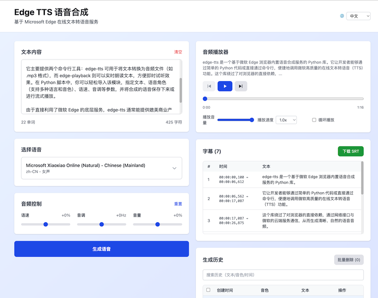

# edge-tts

`edge-tts` 是一个 Python 模块，可在 Python 代码中或通过命令行工具 `edge-tts`、`edge-playback` 调用 Microsoft Edge 的在线文本转语音服务。

## 项目概览

本仓库包含两部分：
1. **核心库/命令行工具**：`edge-tts` Python 模块与 CLI。
2. **Web 子项目**：`edge-tts-web`，提供可视化前端与后端 API 服务。

## 功能简介

**核心库/CLI：**
- 文本转语音（TTS），支持语速/音量/音调调节
- 语音列表查询与多语言/多发音人选择
- 生成音频（MP3）与字幕（SRT）

**Web 子项目（edge-tts-web）：**
- 语音选择与筛选（地区/性别/关键词）
- 生成音频与字幕，支持 ZIP 下载（MP3 + SRT）
- 播放器控制（播放/暂停/上下一个/循环/变速）
- 历史记录（搜索、分页、删除、下载）
- 字幕列表高亮当前播放句
- 本地部署与 Docker 部署

## 演进过程（简述）

1. **CLI/库为核心**：最初以 `edge-tts` 为主，提供 CLI 与 Python 接口。
2. **引入 Web 可视化**：新增 `edge-tts-web`，以 FastAPI + React 提供可视化与 API。
3. **功能增强**：
   - 历史记录、字幕显示与下载
   - 播放器能力增强（变速下载、进度条同步）
   - Docker 部署与 Cloudflare 双存储模式支持

## 当前状态

- **稳定可用**：本地脚本与 Docker 均可运行
- **双存储模式**：
  - `local`（默认）：文件存 `backend/downloads`
  - `cloudflare`：音频/字幕存 R2、历史存 D1
- **下载**：
  - ZIP（MP3 + SRT）支持按播放速度变速（不持久化）
  - 支持仅下载音频（按播放速度变速）

## 安装

使用 `pip` 安装：

```bash
pip install edge-tts
```

如果你只需要命令行工具（`edge-tts`、`edge-playback`），推荐使用 `pipx`：

```bash
pipx install edge-tts
```

## 命令行用法

### 基础示例

生成音频并写出字幕：

```bash
edge-tts --text "你好，世界！" --write-media hello.mp3 --write-subtitles hello.srt
```

直接播放（带字幕）：

```bash
edge-playback --text "你好，世界！"
```

说明：
- 除 Windows 外，`edge-playback` 依赖 [`mpv`](https://mpv.io/) 命令行播放器。
- `edge-playback` 支持大部分 `edge-tts` 参数，但不支持 `--write-media`、`--write-subtitles`、`--list-voices`。

### 切换发音人

查看可用语音：

```bash
edge-tts --list-voices
```

指定语音生成音频：

```bash
edge-tts --voice ar-EG-SalmaNeural --text "مرحبا كيف حالك؟" --write-media hello_in_arabic.mp3 --write-subtitles hello_in_arabic.srt
```

### 调整语速、音量、音调

可通过 `--rate`、`--volume`、`--pitch` 调整输出效果。  
如果使用负值，请写成 `--option=-50%`（带等号），避免被解析为新参数。

```bash
edge-tts --rate=-50% --text "你好，世界！" --write-media hello_with_rate_lowered.mp3 --write-subtitles hello_with_rate_lowered.srt
edge-tts --volume=-50% --text "你好，世界！" --write-media hello_with_volume_lowered.mp3 --write-subtitles hello_with_volume_lowered.srt
edge-tts --pitch=-50Hz --text "你好，世界！" --write-media hello_with_pitch_lowered.mp3 --write-subtitles hello_with_pitch_lowered.srt
```

### 关于自定义 SSML

项目已移除自定义 SSML 支持。原因是 Microsoft 仅允许与 Edge 浏览器可生成内容一致的受限 SSML 结构（通常只允许单个 `<voice>` 包裹单个 `<prosody>`），因此复杂自定义场景无法稳定支持。常用的语音调节能力已通过库参数和命令行参数提供。

## Python 模块使用

你可以在 Python 中直接调用 `edge-tts` 模块。项目内示例：

- [/examples/](/examples/)
- [/src/edge_tts/util.py](/src/edge_tts/util.py)

部分使用该模块的项目：

- [hass-edge-tts](https://github.com/hasscc/hass-edge-tts/blob/main/custom_components/edge_tts/tts.py)
- [Podcastfy](https://github.com/souzatharsis/podcastfy/blob/main/podcastfy/tts/providers/edge.py)
- [tts-samples](https://github.com/yaph/tts-samples/blob/main/bin/create_sound_samples.py)：提供了便于挑选音色的 [mp3 示例集合](https://github.com/yaph/tts-samples/tree/main/mp3)。

## 网页前端（edge-tts-web）

仓库内置 `edge-tts-web` 子项目，提供可视化网页界面。

### 运行截图



### 技术栈与组成

- 后端：`FastAPI + Uvicorn + edge-tts`（目录：`edge-tts-web/backend`）
- 前端：`React + TypeScript + Vite + Tailwind CSS`（目录：`edge-tts-web/frontend`）

### 一键启动

在仓库根目录执行：

```bash
cd edge-tts-web
./start.sh
```

脚本会自动完成依赖检查、安装并启动服务。默认端口如下：

- 前端：`6606`（http://localhost:6606）
- 后端：`6605`（http://localhost:6605）
- API 文档：`http://localhost:6605/docs`

### 停止与清理

进入 `edge-tts-web` 目录后可使用：

```bash
./stop.sh                 # 仅停止服务
./stop.sh --clean         # 停止服务并清理缓存（推荐）
./stop.sh --clean-all     # 停止服务并清理所有缓存和下载文件
./stop.sh --clean-downloads  # 只清理下载文件
./stop.sh --clean-logs    # 只清理日志文件
./stop.sh -h              # 查看帮助
```

清理策略说明：
- `--clean`：清理 Python 缓存（`__pycache__`、`*.pyc`）和前端构建缓存（如 Vite 缓存、`dist`）。
- `--clean-downloads`：清理下载目录中的音频/字幕文件。
- `--clean-logs`：清理后端/前端日志及 PID 文件。
- `--clean-all`：包含以上所有清理项。
- 默认保留：`node_modules/` 与后端 `venv/`。

### Docker 部署

Docker 部署说明请参考 `edge-tts-web/README.md` 的“Docker 部署”章节。

## 目录结构说明

```
edge-tts/
├── edge-tts-web/          # Web 子项目（前端 + 后端）
│   ├── backend/           # FastAPI 后端
│   ├── frontend/          # React 前端
│   ├── start.sh           # 一键启动脚本
│   ├── stop.sh            # 停止/清理脚本
│   └── README.md          # Web 子项目说明
├── src/                   # edge-tts 核心库源码
├── examples/              # 示例代码
└── README.md              # 本文档
```
